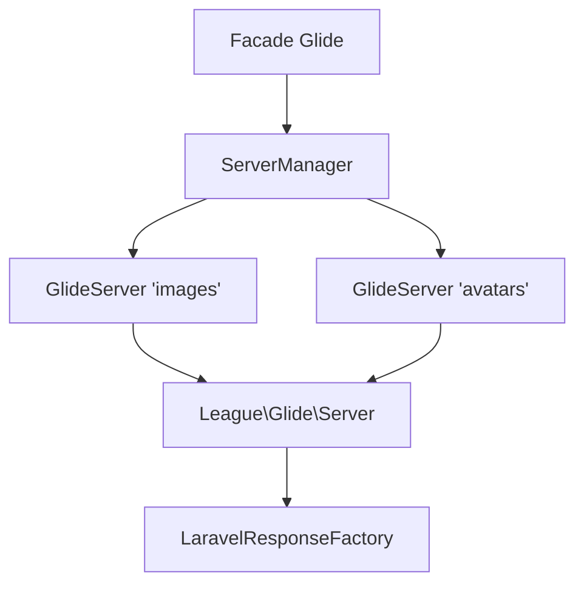

Laravel Glide
=============

Package Laravel intégrant [Glide](https://glide.thephpleague.com/) pour la manipulation d'images à la volée avec support multi-serveurs et URLs signées.

Installation
------------

```bash
composer require axn/laravel-glide
```

Publier la configuration :

```bash
php artisan vendor:publish --tag=glide-config
```

Générer la clé de signature :

```bash
php artisan glide:key-generate
```

Configuration
-------------

### Fichiers

| Fichier | Rôle |
|---------|------|
| `config/glide.php` | Config principale (serveur par défaut, liste des serveurs) |
| `config/glide_servers/*.php` | Config par serveur |

### Serveurs

Chaque serveur est configuré indépendamment avec :

| Option | Description |
|--------|-------------|
| `source` | Disk filesystem source des images |
| `cache` | Disk filesystem pour le cache des images générées |
| `group_cache_in_folders` | Regrouper le cache dans des sous-dossiers par image source |
| `cache_with_file_extensions` | Ajouter l’extension de fichier aux chemins du cache |
| `temp_dir` | Répertoire temporaire pour la lecture EXIF (null : dossier système) |
| `watermarks` | Disk filesystem pour les filigranes (optionnel) |
| `driver` | Driver image : `gd` ou `imagick` |
| `max_image_size` | Taille maximale en pixels (largeur × hauteur) |
| `signatures` | Activer les URLs signées |
| `sign_key` | Clé de signature (env `GLIDE_SIGN_KEY`) |
| `base_url` | URL de base du serveur |
| `defaults` | Manipulations par défaut |
| `presets` | Presets de manipulation nommés |

### Variables d'environnement

| Variable | Description |
|----------|-------------|
| `GLIDE_IMAGE_DRIVER` | Driver image (`gd` ou `imagick`) |
| `GLIDE_SIGN_KEY` | Clé de signature (128+ caractères) |

Les options avancées de Glide 4 (`cache_path_callable`, `encoder`, driver en tableau d’options) peuvent être ajoutées telles quelles dans la config d’un serveur : elle est transmise sans transformation à `League\Glide\ServerFactory`.

Utilisation
-----------

### Façade

```php
use Axn\LaravelGlide\Facades\Glide;

// Générer une URL signée
$url = Glide::url('photo.jpg', ['w' => 300, 'h' => 200]);

// Retourner une réponse image
return Glide::imageResponse('photo.jpg', ['w' => 300]);

// Image en Base64
$base64 = Glide::imageAsBase64('photo.jpg', ['w' => 100]);
```

### Multi-serveurs

```php
// Serveur par défaut
Glide::url('photo.jpg', ['w' => 300]);

// Serveur spécifique
Glide::server('avatars')->url('user.jpg', ['w' => 100, 'fit' => 'crop']);
```

### Presets

Les presets sont définis dans la config de chaque serveur :

```php
// Utiliser un preset
$url = Glide::url('photo.jpg', ['p' => 'small']);
```

### Routes

Le package fournit un contrôleur générique et un enregistreur de routes ; l’application (ou un package) reste maîtresse du contexte middleware puisque l’appel se fait depuis ses propres fichiers de routes :

```php
// routes/static/glide.php
use Axn\LaravelGlide\Facades\Glide;

Glide::routes();                // tous les serveurs
Glide::routes(['images']);      // ou un sous-ensemble
```

Pour chaque serveur, une route `GET {base_url}/{path}` nommée `glide.{serveur}` est enregistrée.

Points d’attention :

- chaque serveur exposé doit avoir un `base_url` distinct (deux routes sur la même URI s’écrasent) ;
- une signature invalide ou un fichier source absent produit une réponse 404.

### Vider le cache

```bash
php artisan glide:clear           # tous les serveurs
php artisan glide:clear images    # un serveur donné
```

La commande refuse d’agir si le serveur n’a pas de `cache_path_prefix` (le disque entier serait supprimé).

Architecture
------------



| Classe | Rôle |
|--------|------|
| `ServiceProvider` | Enregistre le singleton, publie la config, enregistre la commande |
| `ServerManager` | Gère les instances de serveurs, résout les disks |
| `GlideServer` | Wrapper autour de `League\Glide\Server` |
| `LaravelResponseFactory` | Adapter pour les réponses HTTP Laravel |
| `GlideController` | Contrôleur générique des routes enregistrées par `Glide::routes()` |
| `GlideKeyGenerate` | Commande Artisan `glide:key-generate` |
| `GlideClear` | Commande Artisan `glide:clear` (vidage du cache) |
